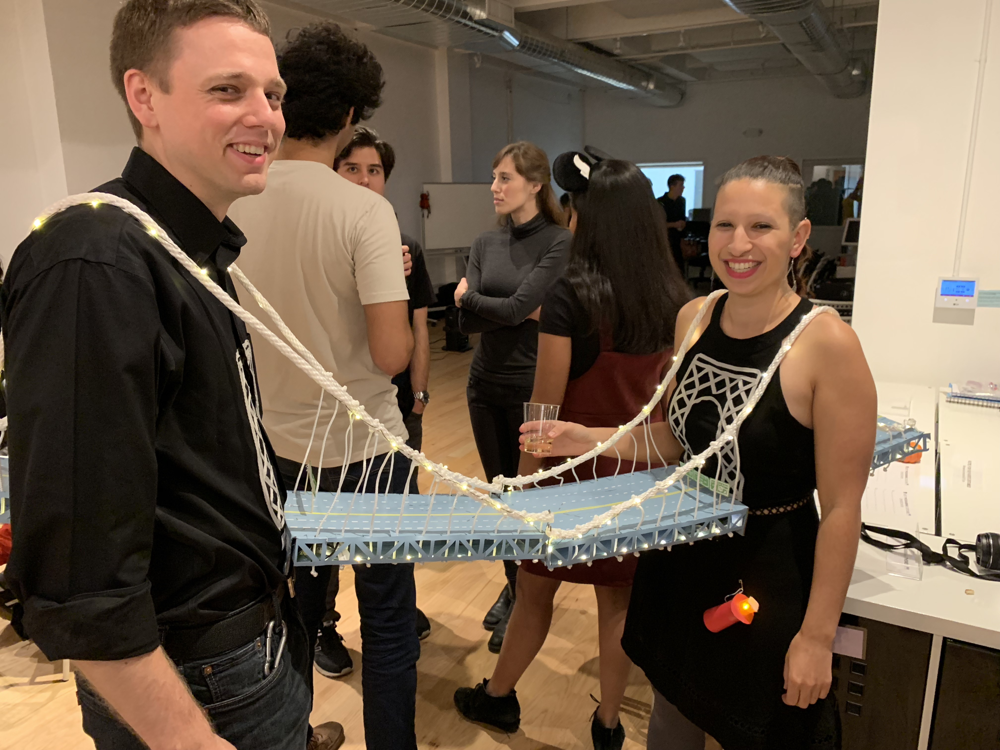
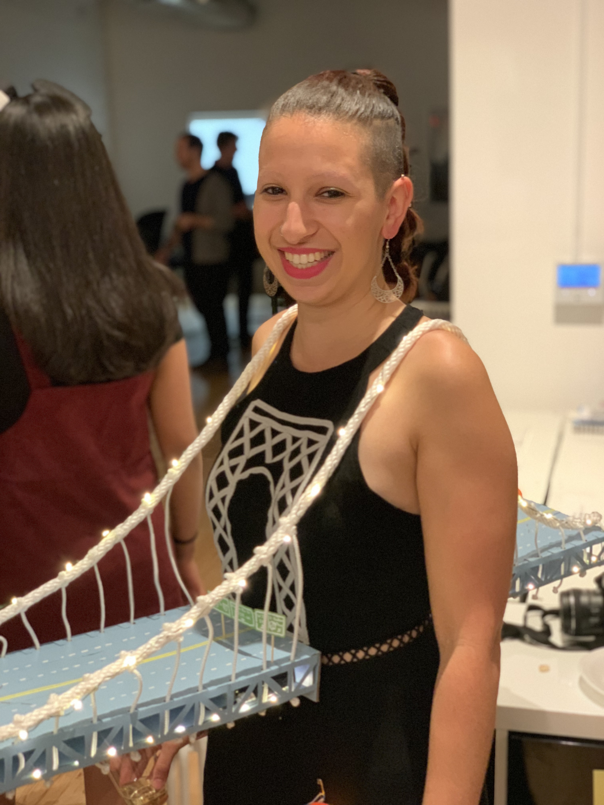
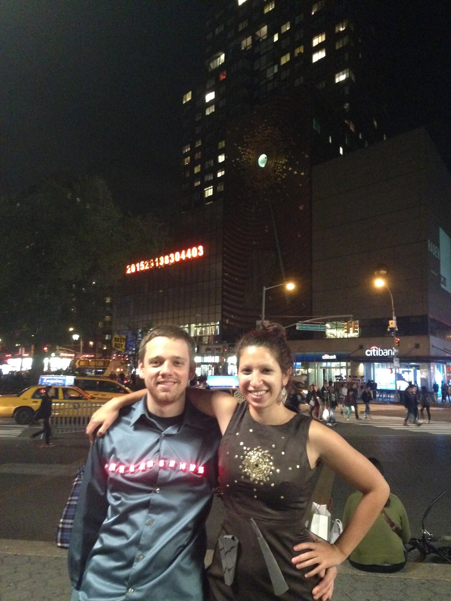

  

Someday I would love to expand this section to include tutorials for some of these projects!

 

## NYC-themed Halloween costumes

I truly love NYC! (And also sewing and electronics.) Here are a couple recent Halloween costumes I made with my partner:

{width=40%} {width=25%}

{width=30%}

{width=30%} {width=30%}

 

## Light-up subway map wall-hanging

Here is a light-up subway map I made using copper tape and surface-mount LEDs, on top of a Manhattan neighborhood cutting board.

{width=30%} {width=30%} 

{width=30%} {width=30%} 

 

## Quilting

My partner's grandmother started a cross-stitch project, but wasn't able to finish it. We picked up the project where she left off, and made a colorful quilt!

{width=30%} {width=30%}

 

## Stained Glass

Many of the apartments I've lived in uptown have french doors with windows that have been painted over many times. In one apartment, I stripped the paint off of the top windows, and made stained-glass panels to replace some of them!

{width=30%} {width=30%}

