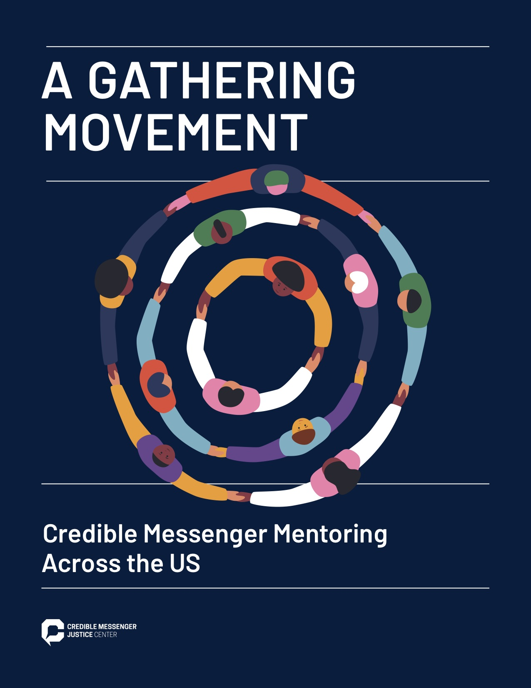

  

### Op-Ed: We Need More Housing–Not More Cops–to Make Our Subways Safer

Written in collaboration with Brandon West and the NYC DSA Racial Justice Working Group.

Op-Ed: [Opinion: We Need More Housing–Not More Cops–to Make Our Subways Safer (City Limits, 4/6/2022)](https://citylimits.org/2022/04/06/opinion-we-need-more-housing-not-more-cops-to-make-our-subways-safer/)

 

### Credible Messengers: Qualitative interviews & Analysis 

{width=30%}

Report: [A gathering movement: Credible messenger mentoring across the US](https://cmjcenter.org/wp-content/uploads/2022/01/A-GATHERING-MOVEMENT-Credible-Messenger-Mentoring-Across-the-US.pdf)

 

### My week at Occupy City Hall (summer 2020)

{width=30%}

Blog Post: [My week at Occupy City Hall to defund the NYPD](http://txti.es/alicia-uta0a723ksqbscaq/images)

 

### Working in Togo as a data and research manager for Integrate Health

{width=60%}

Blog: [Tales of Togo](https://talesoftogo.wordpress.com/)

 

### Programming at the Recurse Center

Blog: [Alicia Recurses](https://aliciarecurses.wordpress.com/)